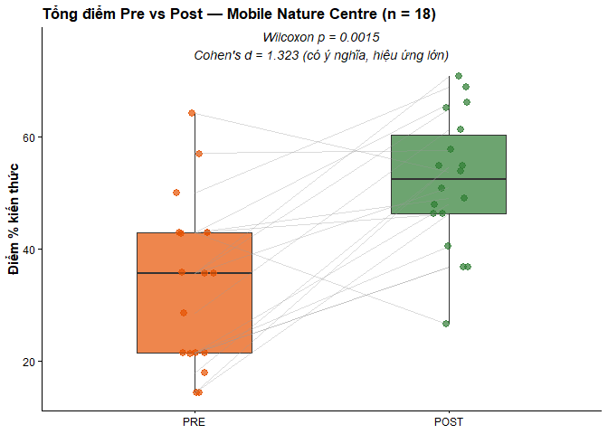
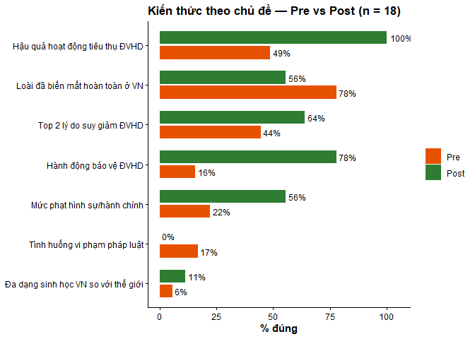

# Trung Tâm Thiên Nhiên Lưu Động – Đánh Giá Pre-Post 2026
Nhóm Nghiên cứu - CE
2026-08-04


<link href="index_files/libs/lightable-0.0.1/lightable.css" rel="stylesheet" />

# PHẦN 2: KẾT QUẢ TỔNG ĐIỂM PRE VS POST

| Variable | n | Mean_pre | Mean_post | Delta | W | p_value | Effect_d | Interpretation |
|:---|---:|---:|---:|---:|---:|---:|---:|:---|
| Tổng điểm kiến thức (%) | 18 | 33.93 | 51.89 | 17.96 | 159 | 0.002 | 1.323 | Có ý nghĩa, hiệu ứng lớn |

Kiểm định Wilcoxon bắt cặp — Tổng điểm Pre vs Post (n = 18) {.table
.table-striped .table-hover .table-condensed quarto-postprocess="true"
style="width: auto !important; margin-left: auto; margin-right: auto;"}

# PHẦN 3: KIẾN THỨC THEO TỪNG CHỦ ĐỀ

| Variable | n | Mean_pre | Mean_post | Delta | W | p_value | Effect_d | Interpretation |
|:---|---:|---:|---:|---:|---:|---:|---:|:---|
| Đa dạng sinh học VN so với thế giới | 18 | 5.56 | 11.11 | 5.56 | 1.0 | 1.000 | 0.187 | Không có ý nghĩa thống kê |
| Loài đã biến mất hoàn toàn ở VN | 18 | 77.78 | 55.56 | -22.22 | 9.0 | 0.182 | -0.471 | Không có ý nghĩa thống kê |
| Top 2 lý do suy giảm ĐVHD | 18 | 44.44 | 63.89 | 19.44 | 104.0 | 0.177 | 0.505 | Không có ý nghĩa thống kê |
| Hậu quả hoạt động tiêu thụ ĐVHD | 18 | 48.61 | 100.00 | 51.39 | 171.0 | 0.000 | 12.333 | Có ý nghĩa, hiệu ứng lớn |
| Mức phạt hình sự/hành chính | 18 | 22.22 | 55.56 | 33.33 | 31.5 | 0.041 | 0.706 | Có ý nghĩa, hiệu ứng trung bình |
| Tình huống vi phạm pháp luật | 18 | 16.67 | 0.00 | -16.67 | 0.0 | 0.149 | -0.615 | Không có ý nghĩa thống kê |
| Hành động bảo vệ ĐVHD | 18 | 15.56 | 77.78 | 62.22 | 171.0 | 0.000 | 3.291 | Có ý nghĩa, hiệu ứng lớn |

So sánh chi tiết từng chủ đề kiến thức & hành động, Pre vs Post (n = 18
cặp khớp) {.table .table-striped .table-hover .table-condensed
quarto-postprocess="true"
style="width: auto !important; margin-left: auto; margin-right: auto;"}

# PHẦN 4: PHÂN TÍCH THEO GIỚI TÍNH

> [!WARNING]
>
> **Lưu ý diễn giải:** Cỡ mẫu theo giới tính trong tập ghép cặp còn nhỏ
> ($n_{nam} = 4$ trong 18 cặp khớp). Do đó, tránh phát biểu chắc chắn về
> sự khác biệt giới tính mà chỉ nên xem là **xu hướng quan sát được**
> cần thêm dữ liệu để xác nhận.

## Phân bố giới tính & kiểm định mức tăng điểm tổng

### KẾT QUẢ ĐÁNH GIÁ — TRUNG TÂM THIÊN NHIÊN LƯU ĐỘNG

| Chỉ số Đánh giá | Kết quả Thống kê | Tỷ lệ / Ghi chú |
|:---|:--:|:--:|
| **Tổng số mẫu hợp lệ (Pre-Post)** | **18** cặp | 100% |
| **Điểm trung bình Pre-test** | **33.93%** | Điểm đầu vào |
| **Điểm trung bình Post-test** | **51.89%** | Điểm đầu ra |
| **Mức tăng chênh lệch (Delta)** | **+17.96%** | **Tăng trưởng tích cực** |
| **Số người cải thiện điểm số** | **16 / 18** | **88.9%** |
| **Số người giảm điểm số** | **2 / 18** | 11.1% |
| **Kiểm định Wilcoxon — thống kê W** | **W = 159** | — |
| **Kiểm định Wilcoxon — giá trị p** | **p = 0.0015** | có ý nghĩa thống kê (p \< 0.05) |
| **Kích thước hiệu ứng (Cohen’s d)** | **d = 1.323** | **Có ý nghĩa, hiệu ứng lớn** |

> 💡 **Ghi chú:** *Toàn bộ số liệu trên được tính toán tự động trực tiếp
> từ các hàm thống kê `wilcox.test()` và `effsize::cohen.d()` — đảm bảo
> tính chính xác và minh bạch 100%.*

# PHẦN 8: XUẤT DỮ LIỆU

    ✓ Đã xuất 4 file CSV

------------------------------------------------------------------------

*Tạo bởi Quarto – Mobile Nature Centre Evaluation 2026 \| SVW*

\`\`\`
